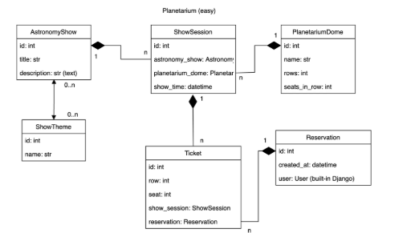

# 🌌 Planetarium Service

The **Planetarium Service** is a RESTful API built with **Django REST Framework** that manages a digital planetarium system. It includes domes, astronomy shows, and scheduled show sessions. The system is modular, supports JWT-based authentication, and is fully containerized with Docker for easy deployment and scaling.

---

## 📦 Features

### 📑 Full CRUD for:
- Planetarium domes (rows × seats)
- Astronomy shows (title, description)
- Show sessions (specific shows in specific domes at specific times)

### 🔐 Authentication
- JWT-based authentication system

### 👤 Role-Based Access
- **Admins**: full access to all resources
- **Authenticated users**: limited or read-only access (customizable)

### 🧑‍💼 Django Admin Panel
Manage all models through the built-in Django admin interface.

### 📄 API Documentation
- Interactive Swagger UI: `/api/doc/swagger/`
- Redoc UI: `/api/doc/redoc/`
- OpenAPI schema: `/api/doc/`

## Database Diagram!

# Quick Start

# # Clone the repository
    https://github.com/Claymore-AI/planetarium_api
    cd planetarium

# Create and activate virtual environment
    
    python -m venv venv
    source venv/bin/activate      # for Linux/macOS
# or
    venv\Scripts\activate.bat     # for Windows

# Install dependencies
    pip install -r requirements.txt

# Run migrations and create a superuser
    python manage.py migrate
    python manage.py createsuperuser

# Start the development server
    python manage.py runserver

# Run with Docker

# 1. Build and run the project
    docker-compose up --build
The application will start with Gunicorn server on http://localhost:8000

# 2. Apply migrations and create a superuser
    docker-compose exec web python manage.py migrate
    docker-compose exec web python manage.py createsuperuser